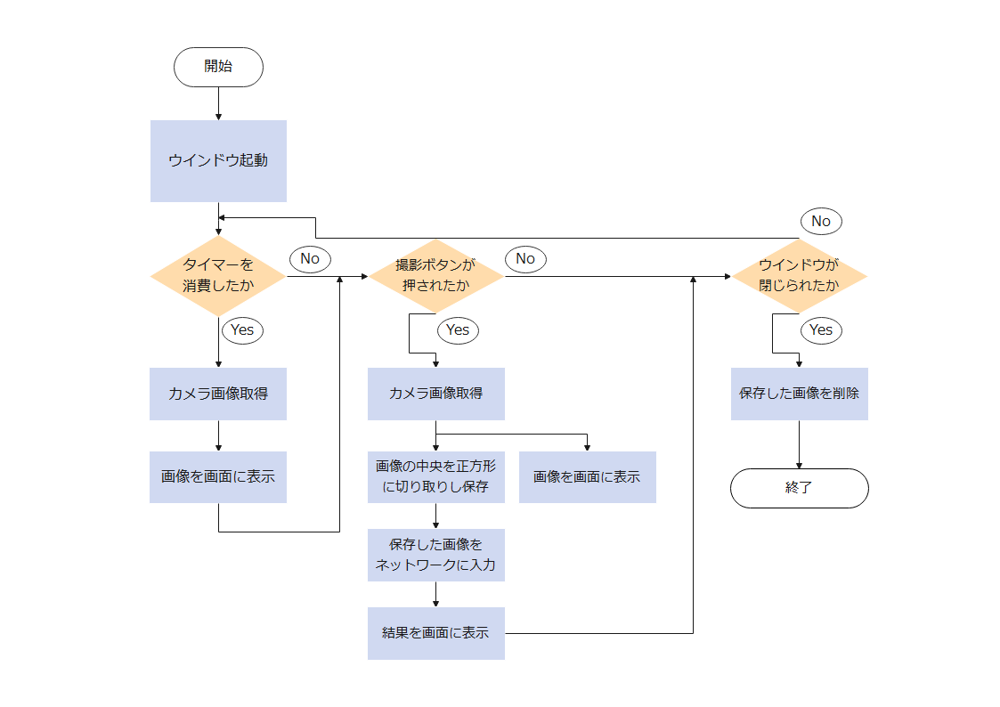
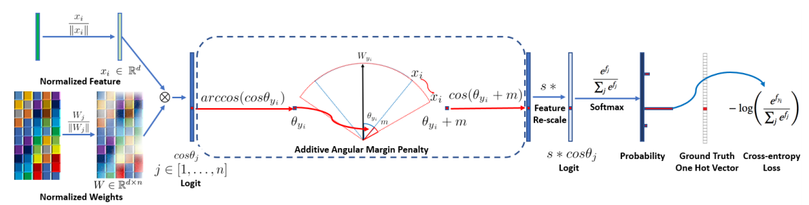
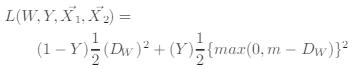

# What celebrity do you look like?

撮影対象がどんな有名人と顔が似ているか検出するアプリケーション<br>

## 実行方法
### 実行環境の作成
本アプリケーションの起動及び実行に必要な環境は以下の通りです．<br>
また，実行に伴い，学習済みモデルがGPU上で訓練されたものである関係上，GPUの搭載されたマシン以外では動作しません．<br>
**macOS MojaveよりMacはCUDAをサポートしなくなったため，本アプリケーションはMac非対応とします．**<br>

ライブラリ |バージョン
:--- | :---
Python | 3.6
CUDA | 11.1
PyTorch | 1.7.1
torchvision | 0.8.2
Pytorch Metric Learning | 0.9.96
wxPython | 4.0.4
OpenCV | 3.4.2
NumPy | 1.19.2

#### GPUセットアップ
コンソールにて`nvidia-smi`コマンドを使用し，CUDAバージョンが11.0以上であるか確認してください．<br>
`nvidia-smi`が通らない，もしくはCUDAバージョンが異なる場合は以下の手順に従ってインストールをお願いします．<br>

##### ubuntu 18.04の場合
**以下コマンドはsudoユーザで実行すること**<br>

```
# nvidia-driverとCUDA driverの削除
# nvidia-smiが通らない場合は不必要
sudo apt-get --purge remove nvidia-*
sudo apt-get --purge remove cuda-*
sudo apt autoremove

# nvidia-driverのインストール
wget https://developer.download.nvidia.com/compute/cuda/repos/ubuntu1804/x86_64/cuda-ubuntu1804.pin
sudo mv cuda-ubuntu1804.pin /etc/apt/preferences.d/cuda-repository-pin-600
wget https://developer.download.nvidia.com/compute/cuda/11.2.0/local_installers/cuda-repo-ubuntu1804-11-2-local_11.2.0-460.27.04-1_amd64.deb
sudo dpkg -i cuda-repo-ubuntu1804-11-2-local_11.2.0-460.27.04-1_amd64.deb
sudo apt-key add /var/cuda-repo-ubuntu1804-11-2-local/7fa2af80.pub
sudo apt-get update
sudo apt-get -y install cuda-drivers
```
実行後は再起動をお願いします．<br><br>
詳細は以下を参照してください．<br>
[CUDA Toolkit 11.2 Update 1 Downloads](https://developer.nvidia.com/cuda-downloads?target_os=Linux&target_arch=x86_64&target_distro=Ubuntu&target_version=1804&target_type=deblocal)<br>
[NVIDIA Docker って今どうなってるの？ (20.09 版)](https://medium.com/nvidiajapan/nvidia-docker-%E3%81%A3%E3%81%A6%E4%BB%8A%E3%81%A9%E3%81%86%E3%81%AA%E3%81%A3%E3%81%A6%E3%82%8B%E3%81%AE-20-09-%E7%89%88-558fae883f44)<br>

##### Windows10の場合<br>
以下サイトの手順に従ってアンインストール/インストールをお願いします．<br>
[NVIDIA ドライバーの再インストール手順](https://support.borndigital.co.jp/hc/ja/articles/360019550274-NVIDIA-%E3%83%89%E3%83%A9%E3%82%A4%E3%83%90%E3%83%BC%E3%81%AE%E5%86%8D%E3%82%A4%E3%83%B3%E3%82%B9%E3%83%88%E3%83%BC%E3%83%AB%E6%89%8B%E9%A0%86)

#### Anacondaのインストール
本アプリケーションの実行に際し，Anacondaを用いた仮想環境の構築を推奨します．<br>
##### ubuntu 18.04の場合
以下サイトの手順に従ってインストールをお願いします．<br>
[【初心者向け】Ubuntu18.04にAnacondaを導入しよう！](https://www.sejuku.net/blog/85373)<br>

##### Windows10の場合
以下サイトの手順に従ってインストールをお願いします．<br>
※コマンドライン環境の設定は不必要です．Anaconda Prompt (anaconda3)が起動できれば問題ありません．<br>
[Windows版Anacondaのインストール](https://www.python.jp/install/anaconda/windows/install.html)<br>

#### 仮想環境の作成及びライブラリのインストール<br>
**以降はOSに関わらず同じ操作です．**<br>
```
# 仮想環境の作成
conda create -n [環境名(任意)] python=3.6

# 仮想環境の起動
conda activate [環境名(先ほど入力した環境名)]

# 必要ライブラリのインストール
# NumPyはpytorchと同時にインストールされるため個別にインストールする必要はない
conda install pytorch torchvision cudatoolkit=11.0 -c pytorch
conda install pytorch-metric-learning -c metric-learning -c pytorch
conda install wxpython
conda install opencv
```
以上で環境構築は終了です．<br>

### 実行方法
`face_similarity`ディレクトリ直下で以下のコマンドを実行<br>
`python main.py`<br>
※アンチウイルスソフトによってはカメラ使用時に制限がかかる可能性があるため，その場合は個別に許可を出す必要があります<br>

### トラブルシューティング
##### カメラの映像が表示されない/映ってほしいカメラと違うカメラが起動している
カメラの番号指定がズレています．お手数ですが，Window.pyの28行目<br>
`self.camera = Camera(0)`の数字を変更して再度実行をお願いします．<br>
##### 上記手順を試してもカメラの映像が表示されない
カメラ，もしくはドライバが壊れている関係でOSにカメラが認識されていません．<br>
お手数ですが，別のカメラの用意をお願いします．


## 本アプリケーションについて
### 表示される名前について
[みんなのランキング 芸能人・著名人](https://ranking.net/celebrity)より，以下の2ランキングの上位20人ずつが表示されるようになっています．<br>
[イケメン俳優ランキング！最もかっこいい日本人俳優は？](https://ranking.net/rankings/most-ikemen-actors)<br>
[日本の芸能人美人ランキング！日本人No.1美女タレントは？](https://ranking.net/rankings/most-beautiful-japanese-female-geinojin)<br>

### 使用している技術
本アプリケーションは2018年に公開された顔認識モデルである[ArcFace](https://arxiv.org/abs/1801.07698)に上記ランキングから選択した計40人の顔画像を学習させることで，カメラから取得した画像がどの人物の顔に似ているかを出力するアプリケーションです．

#### ArcFace

2018年にDengらが開発した，深層学習による顔認識手法．<br>
距離学習と呼ばれる学習手法の1つで，角度ベースの距離学習を行う．<br>
##### 距離学習(Metric Learning)
一般的な深層学習手法(畳み込みニューラルネットワークなど)は入力データの特徴のうち，どの特徴を用いれば最も良好に識別が可能であるか，その重みづけを学習する．言い換えれば，**入力データの特徴を学習する**手法といえる．<br>
これに対し距離学習は，**入力データ間の類似度**を学習する．最も一般的な距離学習手法であるSiamese Networkでは，入力間のユークリッド距離を最小化するContrastive Loss(下式)による学習を行う．<br>
<br>
距離学習を用いるメリットは，<br>
・似ているか似ていないかが学習できるため，似ているが違うもの/似ていないが同じもの(hard negative sample / hard positive sample)の識別が得意(Fine-grained Classification)<br>
・特徴間の類似性を学習するため，学習の際に1クラスあたりのデータ数が少なくても(ある程度偏っていても)学習が可能(Few-shot Learning)<br>
の主に2点にある．<br>
ArcFaceでは，Siamese Networkと異なり，コサイン類似度とSoftmax関数を用いた損失関数による学習を行う．コサイン類似度とSoftmax関数を用いた損失関数を用いる手法はArcFaceの他に[SphereFace](https://arxiv.org/abs/1704.08063)や[CosFace](https://arxiv.org/abs/1801.09414)が代表的であるが，ArcFaceはこれら手法の後継手法として提案された手法であるため，非常に精度が高い手法といえる．<br>
<br><br>
本アプリケーションの制作に際し行ったArcFaceの学習は以下のような手順を踏んでいる．<br>
1. ImageNetで学習済みのResNet50(一般的な家庭向けGPUでは学習不可能であるためpytorchが用意している学習済みモデルを使用)の最終層にArcFaceLossを接続し，LFWデータセット(顔認識タスクのベンチマークに使われる公開データセット)による学習を行う
2. 1.にて学習を行ったモデルの最終層を本アプリケーションの識別対象である40クラスが出力されるように差し替え，自作データセットによる学習を行う．

##### 自作データセット
[表示される名前について](#表示される名前について)に記載したランキングから選択した計40人の正面(z軸回転をおよそ±30°まで許容)からの写真を1人あたり3枚集め，顔が中央にくるように正方形に切り取り，144×144にリサイズしたデータセット．<br>
本アプリケーションのための学習において評価用データセットは不要と判断したため，validation，testデータは用意せず，学習用データのみで40クラス120枚のデータセットとなる．
